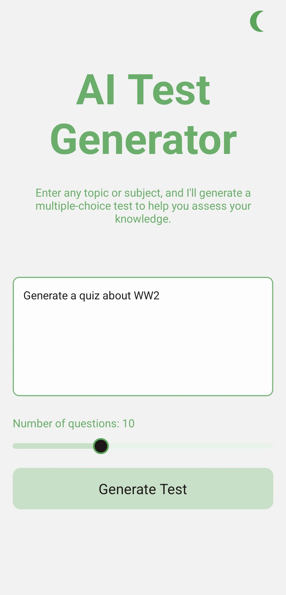
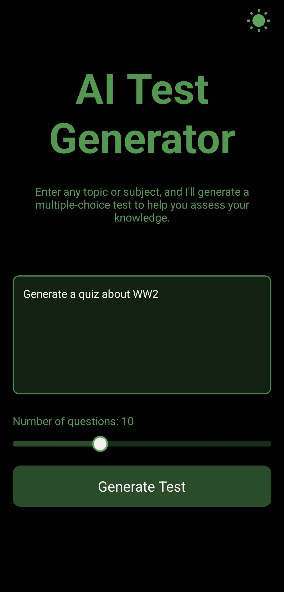
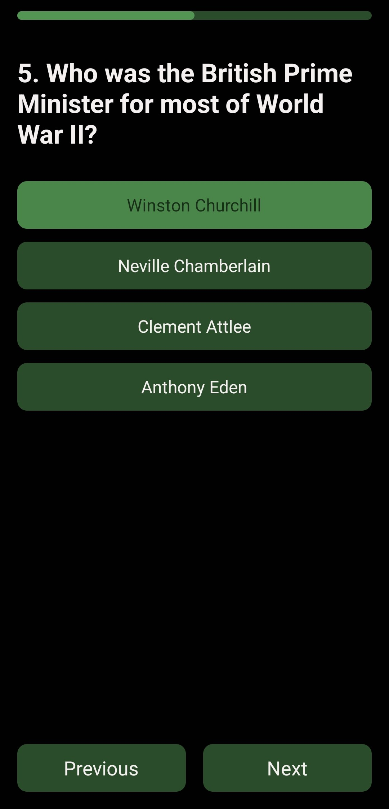

<div align="center">
  <h1>🧠 Test Me</h1>
  <p><strong>AI-Powered Quiz Generator</strong></p>
  <p>
    <a href="#features">Features</a> •
    <a href="#screenshots">Screenshots</a> •
    <a href="#setup">Setup</a> •
    <a href="#tech-stack">Tech Stack</a>
  </p>
</div>

---

## ✨ Features

- 🤖 Generate custom quizzes on any topic using AI
- 📝 Adjust question count (5-20 questions)
- ✅ Multiple choice format with instant scoring
- 🌓 Dark/Light theme support
- 🎯 Smooth animations and haptic feedback
- 📊 Real-time progress tracking

## 📱 Screenshots

<div align="center">
  <div style="display: flex; justify-content: space-between;">
    
    
    
    
  </div>
</div>

## 🚀 Setup

1. **Install dependencies**
   ```bash
   npm install
   ```

2. **Configure environment**
   ```bash
   # Create .env file and add:
   EXPO_PUBLIC_OPENAI_API_KEY=your_openai_api_key
   ```

3. **Start developing**
   ```bash
   npx expo start
   ```

## 🛠 Tech Stack

- [**Expo**](https://expo.dev) - React Native framework
- [**Tamagui**](https://tamagui.dev) - UI components
- [**OpenAI**](https://openai.com/api) - AI integration
- [**React Native Reanimated**](https://docs.swmansion.com/react-native-reanimated/) - Animations
- [**Zod**](https://zod.dev) - Type validation
- [**Zustand**](https://zustand-demo.pmnd.rs/) - State management

## 📁 Project Structure

The app uses file-based routing with Expo Router. Main components are:
- `/src/app/index.tsx` - Home screen with quiz generation
- `/src/app/quiz.tsx` - Quiz interface and scoring
- `/src/services/openai.ts` - OpenAI integration
- `/src/types/question.ts` - Type definitions

## License

MIT
